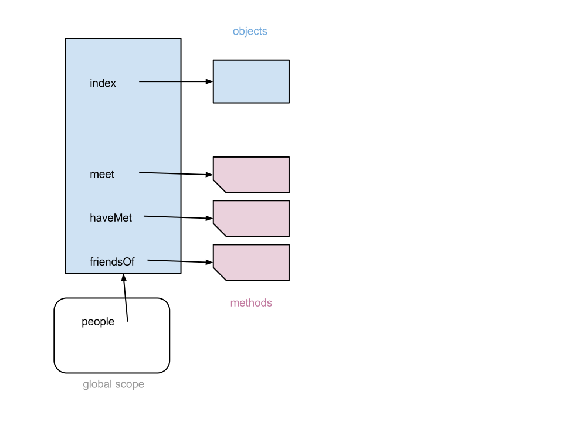
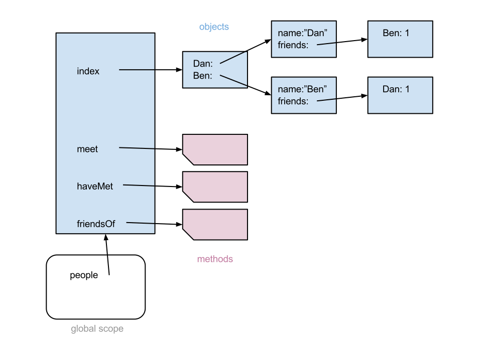

Homework #2

---

**1)  Simulating Arrays**

_[Difficulty: Easy]_

Create an ordinary object which is not an actual Array but behaves
(somewhat) like one.  You may use a global variable `array` to store
your pseudo-array.
When creating `array` initially, have it represent an empty Array.

**a)**  Give `array` a property named `length` which is always a
non-negative integer, and three more properties `pop`, `push`, and
`join` which are functions (i.e. methods) behaving exactly like the
corresponding method of real Arrays.

You may use the enclosed [template file](pseudo-array-template.js) to get started.


**b)**  Assuming you've implemented `array` correctly, predict the outcome
of the following:
```
array.length=0;
array.push('c');
array.push('b');
array.push('a');
array.pop();
console.log(array.join('a'));
```

**c)**
 Similarly, predict the outcome here:
```
array.length=0;
console.log(array.join(array.push(array.push('a'))));
```

---

**2)  Object Comparison**

_[Difficulty: Moderate]_

**a)**
Write a function `copy(obj)`, which duplicates an object (not just copying a reference to it).  You only need to duplicate only one level: if `obj` contains another object _inner_, the duplicate may share _inner_ rather than copying it too.

Write another function to compare two objects:
`equal(objA,objB)` should return true only when `objA` and `objB` have exactly the same properties with the same values.  Note that two empty objects should be considered equal.

Write a third function:
`similar(objA,objB)` should return true only when `objA` and `objB` have exactly the same properties, regardless of their values.

**b)**
We can interpret objects as _sets_ of properties, and merge those sets in various ways.  Let's define three such merges:

*Union*: The union of objects A,B is a new object which contains all the properties found in either A or B.  If a property is found in both, the merged property gets the shared key and the value `(A[key] || B[key])`.
For example: the union of `{a:1,b:0}` and `{a:0,c:0}` is `{a:1,b:0,c:0}`.

*Intersection*: The intersection of objects A,B is a new object which contains only those properties found in BOTH A and B.  The value of each intersecting property is `(A[key] && B[key])`.
For example, the intersection of `{a:1,b:0}` and `{a:0,c:0}` is `{a:0}`.

*Subtraction*: The subtraction of B from A, aka "A minus B", is an object which contains all the properties of A which are NOT in B.  Note that this merge is usually not symmetric: _A minus B_ doesn't equal _B minus A_ (except in one case, which you should identify!)
For example, `{a:1,b:0}` minus `{a:0,c:0}` is `{b:0}`, and the reverse subtraction is `{c:0}`.

Using those definitions, implement a function for each:

* `union(objA,objB)`

* `intersect(objA,objB)`

* `subtract(objA,objB)`

Your functions may return undefined if either of their arguments is not an object.

**c)**
Write five sample assertions to validate each of your three merging functions (15 total).
Remember that when comparing your results to expected, you'll need to see if objects are equal() but not identical.

**d)**
Finally: even if your functions implement perfectly the definitions above, 
intersection and union are still not symmetric.  That is, `similar(union(A,B),union(B,A))` will always be true, but `equal(union(A,B),union(B,A))` may not be.  Likewise with intersection.  Explain!

---

**3)  Cards, improved!** 

_[Difficulty: Easy]_

Revisit your playing card functions from homework #1.  Repackage them in a Toolkit pattern, as methods of a single master object.  You may assign that object to any variable you like, but that variable should not appear in the definitions of your methods.  You'll need to change both your method definitions and their calls to other methods, but their logic will remain the same.

You may adopt the enclosed [template file](cards2-template.js).  Make sure your code still passes all the assertions there!

---

**4) Social network!**

Assume a world in which no two people have the same name.
Create an object `people` whose purpose is to remember everyone ever mentioned and the relationships between them.

_[Difficulty: Moderate]_

**a)**
Write three methods for `people`:

* `people.meet(nameA,nameB)` should accept two names, update `people`, and return the total number of times those two have met, including this new meeting.
If either person isn't yet represented in `people`, add them.
Then increment a count of the meetings between them.
Assume that the order of arguments doesn't matter (i.e. `meet(A,B)` is the same as `meet(B,A)`), and that meeting oneself (A==B) has no effect.

* `people.haveMet(nameA,nameB)` should return a number greater than 0 if those people have met, and some falseish value if they haven't or don't exist.

* `people.friendsOf(name)` should return a string listing the names of all people whom `name` has met at least once (or undefined if `name` doesn't exist).   List the names in alphabetical order, and make sure each name appears only once.

You may use the enclosed [template file](social-network-template.js) to get started.

_Hint:_ the `people` object should contain an index of all people, linking each name to an individual object for that person.  Each such person-object should have two properties:

* `name` is a string for that person's name.  (This redundant copy of the name isn't necessary for the solution, but it may help you debug.)

* `friends` is another index object, unique to each person, with multiple keys (one for each friend that person has met), each with a numeric value.  Because meetings are symmetric (each person meets the other), each number is duplicated in a corresponding property in the friend's index; make sure you update both copies of the number during a meeting.

Here is a diagram showing the data structure after `people` is fully initialized but before any method calls:



Here is the data structure just after the first method call `people.meet('Dan','Ben')`:



_[Difficulty: Hard]_

**b)**
Write another method `people.friendsOfFriendsOf(name)` which returns a string listing, in alphabetical order, all the names of people within two degrees of separation from `name`: they've met either `name` or at least one of `name`'s friends.
Your list may include `name` itself but no duplicates: any person should be listed only once regardless of the number of connections with `name`.

(_Hint:_ the union of sets includes no duplicates!  Perhaps you could recycle code from somewhere?)


<!--
[Reject:]
For any person, let the other person whom they've met most often become their best friend (but note that best friends may not be mutual)!  (If multiple friends tie for the most meetings, the earliest best friend remains).

Any time two people meet for the fourth time or more, each also meets the best friend of the other.  This could trigger a cascade of other meetings!
But no two people may meet more than once during a single event.

One day, a friend named 'Meetso Verioffen', who insists on being called just 'meets', shows up to a party.  Make sure this isn't awkward!
-->
