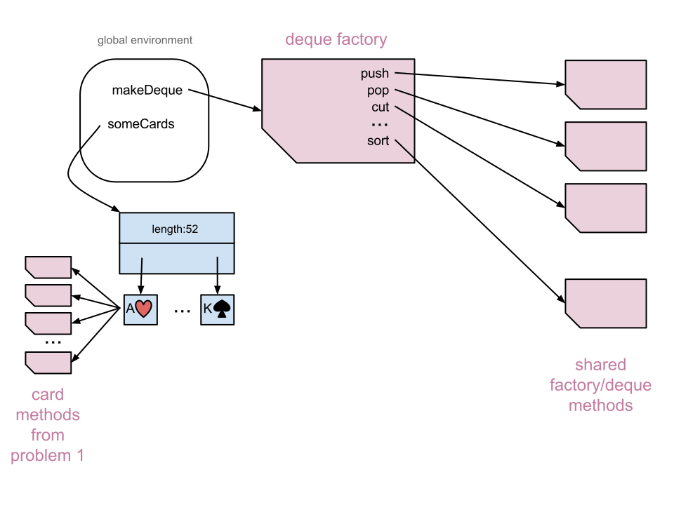
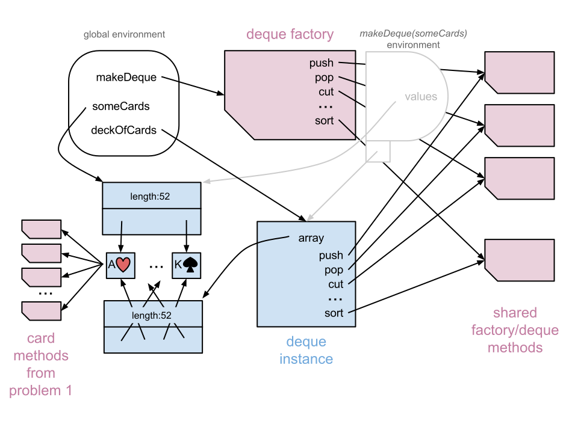

Homework #3

---

**1) Still more Playing Cards!**

**a)** _[Moderate]_
Revisit your playing card functions from homework #2 and repackage them in a Factory pattern.  You will have a single master function
`makeCard(id)` (the Factory) which, with each call, makes and returns an object representing a single card.  Each card object remembers its own _id_ and has methods to calculate its other attributes and relations.
Try to avoid redundant copies of the various methods.  To share methods between card instances, make them methods of the factory itself and link card instances to them.

Certain helper functions (e.g. for validating arguments) may belong only to _makeCard_ and not any instances.

Because each card knows its own id, the methods need fewer arguments than before.  Change the method signatures as follows:

* rank() --> 1..4
* suit() --> 1..4
* cardID() --> 0..51
* color()--> string
* name() --> string
* precedes(cardObj) --> boolean
* sameColor(cardObj)--> boolean
* nextInSuit() --> 0..51
* prevInSuit() --> 0..51

**b)** _[Easy]_ Use the factory to make a few cards, and test their methods with assertions.  For each card method, write 2 assertions to test it.  You may adapt the assertions from earlier templates.

**c)** _[Easy]_ Write a few more assertions proving that your methods are shared between instances and not duplicates.
(Hint: check for object identity.)

---

**2) Stacking the Deque**

"Deque" (pronounced "deck") is an acronym for "double-ended queue", a sequential data structure similar to an Array but with different rules of access.  While an Array is random-access (i.e. any element is accessible), a deque can only be accessed at either of its ends (like a roll of mints with both ends open).  The two ends can be called "top" and "bottom".

**a)** _[Moderate]_
Write a deque factory, a function `makeDeque(values)` which follows the Factory pattern.  Each call to `makeDeque(values)` should build and return a new deque instance, which holds a copy (not just an alias!) of the array _values_.  Each deque instance has the following methods, which are shared by all deques and the factory itself:

* `top()`: return the element on top of the deque

* `bottom()`: return the element on bottom of the deque

* `push(val)`: add an element to the top

* `pop()`:  remove and return the top element

* `shift()`: remove and return the bottom element

* `unshift(val)`: add an element to the bottom

* `cut(offset)`: split the deque near the middle, then swap the two halves.  The new top element will have been previously just below the split.  Use parameter _offset_ to decide the split point as follows:
	*  if _offset_ is falseish: split at midpoint if the number of elements is even, otherwise just above the middle element;
	*  if _offset_ is non-zero integer: adjust split by _offset_ elements toward top if positive, toward bottom if negative.
Make sure to handle reasonably all possible combinations of offset and deque length.

* `sort(compareValsFn)`: reorder all elements of deque according to the comparison defined by the function _compareValsFn_, passed as an argument to _sort_.
`compareValsFn(a,b)` should return a negative number whenever value _a_  belongs somewhere below value _b_ in the sorted result, and a positive number whenever _a_ belongs above _b_.  (Zero means they're equivalent: either may come first.)

* `map(convertValFn)`: return an array whose elements are derived from the values in deque, converting each value with the function `convertValFn(val)`.

In part b), you'll use a deque to simulate a deck of 52 cards, but your deque implementation should be completely general, able to handle any number of any type of element.

Although it would be possible to implement a deque as an Array instance, for this exercise make it an ordinary object which *contains* an Array, a copy of the _values_ parameter.
Be sure to **copy** the _values_ array into the deque instead of using the original; you don't want anyone messing with the deque's content through another reference.

Use the [template file](deque-template.js) to get started.

**b)** _[Easy]_
Use your _makeCard_ factory from Problem 1) to create _someCards_, an array of 52 different card objects.  The factory should have given each card some methods to retrieve its own name, color, etc.

Figure 1 below represents the structures you should have after parts a) and b).


**c)** _[Easy]_
Use your factory _makeDeque_ to create _deckOfCards_, a deque holding the cards in _someCards_.  Figure 2 represents the new structure:



Write a comparison function to sort _deck_ by card ID, with card 51 (King of Clubs) on top.
Make sure the sorted deck passes the tests below:
```
var deck = makeDeque(/*something*/);
deck.sort(/*something*/);
deck.cut(1);
assert(deck.top().name() === 'Ace of Spades', 'Failed Ace of Spades test');
```

Now sort the deck by card name, alphabetically from bottom to top.   (Hint: You'll need to write a new comparison function.)
```
deck.sort(/* something new*/);
assert(deck.bottom().name() === 'Ace of Clubs', 'Failed Ace of Clubs test');
assert(deck.top().name() === 'Two of Spades', 'Failed Two of Spades test');

```

**d)** _[Easy]_
Without changing your deque factory, use it to create another deque which holds the names of all 19 students in this class, plus 5 TAs (yes, we're very mean, making you remember all your teammates!)
Sort the names alphabetically, bottom to top, by the SECOND letter of the name (e.g. "Dan" would precede "Ben" because 'a'<'e').  Then test it:
```
var everyone = makeDeque(/*something*/);
everyone.sort(/*something*/);
var theFinalName = '/*someone*/';
assert(everyone.top() === theFinalName, 'Failed name test');
```

**e)** _[Easy]_ 
In your factory, add a deque method `shuffle()` which shuffles the elements into a random order.
First, try the easy (but slow and ineffective) way by using Array.sort() with a comparison function returning a random result.

Then do it properly using the [in-place Knuth-Fisher-Yates algorithm](http://bost.ocks.org/mike/shuffle/).

With the new factory definition, create a new _deckOfCards_ and shuffle it.
Use its _map(...)_ method with a custom callback function to view the shuffled elements by card.id.
Then use _map(...)_ with a different callback function to view them by card.name().

**f)** _[Moderate]_
Improve your deque implementation to ensure that no one can add unauthorized elements to it (e.g. extra Aces).
Change anything necessary so that `push(val)` and `unshift(val)` only add _val_ if it was part of the original deque and is currently missing (via `pop()` or `shift()`).

(Hint: each deque will need some kind of inventory of all elements released with a _pop_ or _shift_.)
